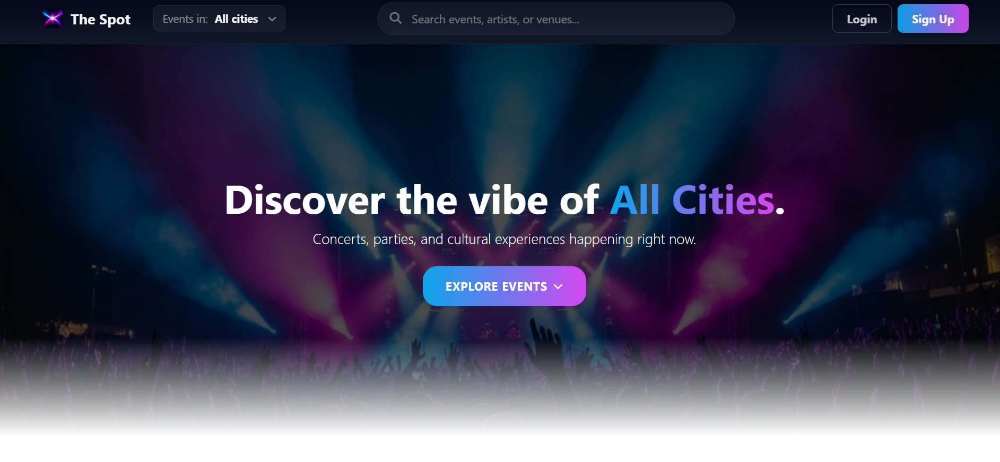
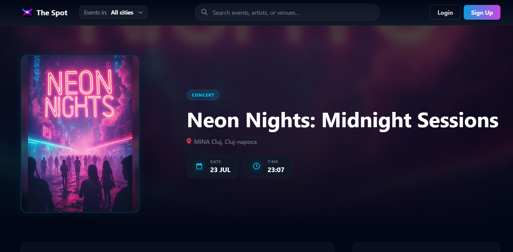

# The Spot

The Spot is a full-stack event management platform developed as my Bachelor's Degree project.

The application allows users to discover local events, create and manage their own events, participate in events through an RSVP system and interact with a modern, responsive interface.

## Live Demo

https://thespot.ro

## Features

* User registration and authentication
* Email verification and password recovery
* Event creation, editing and management
* RSVP system for event participation
* User profile management
* Advanced event filtering
* Live Search functionality
* Admin dashboard
* Responsive design for desktop and mobile devices

## Security Features

* Password hashing
* CSRF protection
* SQL Injection prevention using Prepared Statements
* Rate Limiting for authentication requests
* Cloudflare Turnstile integration
* Secure file upload validation
* HTTPS enforcement

## Technologies

### Frontend

* HTML5
* CSS3
* JavaScript (ES6)
* Bootstrap 5

### Backend

* PHP
* MySQL

### External Services

* Google Places API
* Cloudflare Turnstile
* PHPMailer (SMTP)

## Database

The database structure is available in:

database/schema.sql

Main entities:

* Users
* Events
* Categories
* Cities
* Event Participants (RSVP)
* Password Resets
* Rate Limits

## Project Purpose

The Spot was developed as a Minimum Viable Product (MVP) focused on simplifying the discovery and management of local events through an intuitive and responsive web platform.

## Author

Liviu Spînu

LinkedIn:
https://www.linkedin.com/in/liviu005/

# Screenshots

## Homepage

## Event Details

